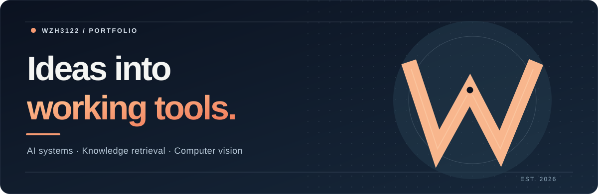

  
    
  <strong>把复杂能力做成真正可用的工具。</strong>
   
  知识检索 · 智能体 · 视觉数据工作流

 

## 你好，我是 wzh3122

我专注于 AI 应用的设计与工程实现，尤其关注复杂文档的检索问答，以及视觉数据从标注到训练的准备流程。公开项目主要使用 Python，重视完整工作流、可部署性和实际使用体验。

## Selected work

<table>
  <tr>
    <td width="50%" valign="top">
      <h3><a href="https://github.com/wzh3122/ATRAG">01 / ATRAG ↗</a></h3>
      
面向复杂文档的知识库与问答工作台。结合文档解析、混合检索、Agent 问答与容器化部署，探索表格、图像和实体关系的检索能力。

      RAG · DOCUMENT INTELLIGENCE · AGENTS
    </td>
    <td width="50%" valign="top">
      <h3><a href="https://github.com/wzh3122/RoadLabel-Studio">02 / RoadLabel Studio ↗</a></h3>
      
面向道路检测场景的桌面标注工具。支持图像分类分级、矩形框检测、人工审核，以及 YOLO / VOC 数据集导出。

      COMPUTER VISION · DATA WORKFLOW · DESKTOP APP
    </td>
  </tr>
</table>

## Current interests

`RAG systems` &nbsp; `Agent workflows` &nbsp; `Document understanding` &nbsp; `Computer vision` &nbsp; `Python`

 

  看项目细节与使用方式，请进入上方仓库。欢迎交流与反馈。

